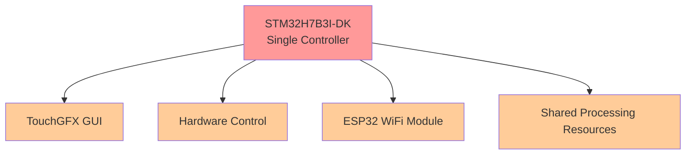

# 🌿 Spirulina Machine Architecture Analysis

## Comparing Development Approaches for Commercial Success

---

## 📋 Executive Summary

This document presents a comparative analysis of two architectural approaches for developing a commercial spirulina cultivation machine: the current STM32H7B3I-DK single-controller setup and a recommended dual-controller system using **Raspberry Pi 4 + STM32G474**. The analysis highlights the price, development time, complexity, and system reliability benefits of adopting the proposed alternative.

---

## 🏗️ Architecture Comparison

### ⚙️ Current Approach



### ⚡ Recommended Alternative Approach

```mermaid
graph TB
    F[Raspberry Pi 4<br/>Main Controller] --> G[Advanced GUI Framework]
    F --> H[AI/ML Processing]
    F --> I[Data Analytics]
    F --> J[Network Management]
    F --> K[OTA Updates]
    F --> R[4.3" HDMI Display]

    L[STM32G474<br/>Hardware Controller] --> M[Real-time Sensor Reading]
    L --> N[Actuator Control]
    L --> O[Motor Control]
    L --> P[CAN-FD Communication]
    L --> Q[Safety-Critical Operations]

    F -.->|UART/CAN-FD| L

    style F fill:#99ff99
    style G fill:#ccffcc
    style H fill:#ccffcc
    style I fill:#ccffcc
    style J fill:#ccffcc
    style K fill:#ccffcc
    style R fill:#ccffcc

    style L fill:#99ccff
    style M fill:#ccddff
    style N fill:#ccddff
    style O fill:#ccddff
    style P fill:#ccddff
    style Q fill:#ccddff
```

---

## 📊 Time, Cost, and Complexity Comparison

### ⎡ Time to Market

| Metric           | ⚙️ STM32H7B3I-DK                  | ⚡ Pi 4 + STM32G474           | 🌟 Result          |
| ---------------- | --------------------------------- | ---------------------------- | ------------------ |
| Development Time | ❌ 6 months                        | ✅ 8 weeks                    | ⚡ 77% faster       |
| Learning Curve   | High (TouchGFX, embedded GUI dev) | Moderate (Linux, Qt/web dev) | Easier overall     |
| Debugging        | Limited                           | Full Linux toolset           | ✅ Faster debugging |

### 💰 Cost Efficiency

| Component       | ⚙️ Current          | ⚡ Alternative                         |
| --------------- | ------------------- | ------------------------------------- |
| Dev Board       | \$89 (H7 DK)        | \$55 (Pi 4 4GB) + \$12 (STM32G474)    |
| Display         | Built-in            | \$35 HDMI                             |
| Additional      | \$15 (ESP32)        | \$8 (microSD) + \$15 cables/enclosure |
| **Development** | \$30,000 (6 months) | \$8,888 (8 weeks)                     |
| **Total**       | \$30,104            | \$9,013                               |
| **Savings**     | ❌ -                 | ✅ \$21,091 (70% reduction)            |

### 🔧 Complexity and Maintainability

| Factor      | ⚙️ Current             | ⚡ Alternative                         | 🔄 Benefit                  |
| ----------- | ---------------------- | ------------------------------------- | --------------------------- |
| GUI Dev     | Complex (TouchGFX)     | Qt/Web: More tools and devs available | Easier onboarding           |
| Expansion   | Difficult (MCU limits) | Modular GPIO & USB                    | Easier to upgrade           |
| Maintenance | Custom hardware        | Standard HDMI/Linux                   | Easier to repair & maintain |

---

## 📈 Hardware Cost Comparison

### 🌟 Bill of Materials (BoM)

| Component               | ⚙️ STM32 Approach    | ⚡ Alternative (Raspberry Pi + STM32G474)                |
| ----------------------- | -------------------- | ------------------------------------------------------- |
| Main Board              | \$89 (STM32H7B3I-DK) | \$55 (Raspberry Pi 4 - 4GB)                             |
| Co-Processor            | –                    | \$12 (STM32G474)                                        |
| Display                 | Built-in LCD         | \$35 (HDMI 4.3")                                        |
| Connectivity            | \$15 (ESP32)         | Built-in WiFi + \$8 (microSD) + \$15 (cables/enclosure) |
| **Total Hardware Cost** | **\$104**            | **\$125**                                               |

---

## ⚖️ Reliability & Safety

### ⚠ Current Risks (STM32 Only)

* Shared CPU for GUI and control may cause conflicts
* System hangs affect both UI and actuators
* TouchGFX limitations reduce UX polish

### ✅ Alternative Benefits (Split System)

* Real-time control isolated on STM32G474
* GUI cannot crash critical functions
* Use of CAN-FD for safe, robust comms
* OTA & GUI crash tolerance

---

## 📊 Final Recommendation

The **Raspberry Pi 4 + STM32G474** architecture significantly reduces:

* ⏱ **Development Time** (8 weeks vs. 6 months)
* 💰 **Total Cost** (70% savings)
* 🔧 **System Complexity** (dedicated tools per role)
* ⚠ **Technical Risk** (no single point of failure)

It **increases**:

* 🚀 Performance (8x CPU, 4000x RAM)
* 📊 Scalability (AI, remote control, modular design)
* 🔨 Maintainability (standard hardware)
* 🌍 Commercial appeal (modern HMI, OTA, analytics)

---

> 🌟 **This modern two-controller system accelerates delivery, lowers costs, improves reliability, and positions your spirulina cultivation machine for long-term growth.**
